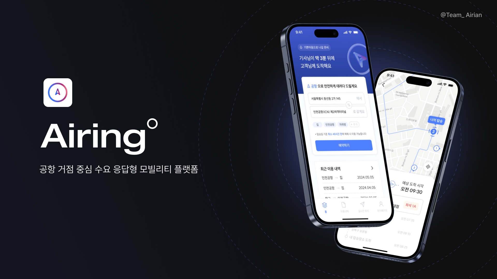

# Airing
인천공항 거점 수요응답형 교통서비스 '에어링'

 

## About
에어링 Airing은 인천국제공항을 중심으로 운영되는 맞춤형 수요 응답형 교통(DRT) 플랫폼입니다. 서울 지역의 여행객을 대상으로 AI 알고리즘을 활용하여 승객 간의 근
접성을 바탕으로 ‘팟’을 형성하고, 이를 10인승 이상의 차량과 매칭시켜 최적의 경로로 공항까지 안내합니다.

 

## @Team_Airing

<table>
  <tr>
    <td align="center">
      <a href="https://github.com/kyungheee">
         
        <b>kyungheee</b>
      </a>
    </td>
    <td align="center">
      <a href="https://github.com/yes8943">
         
        <b>yes8943</b>
      </a>
    </td>
    <td align="center">
      <a href="https://github.com/eahcnuelee">
         
        <b>eahcnuelee</b>
      </a>
    </td>
    <td align="center">
      <a href="https://github.com/yangbaee">
         
        <b>yangbaee</b>
      </a>    
    </td>
  </tr>
</table>

